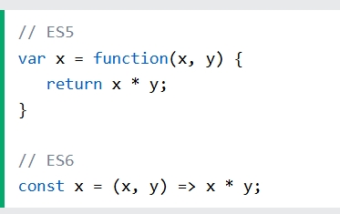

# New Features in ES6


### [The let and const keyword](https://www.w3schools.com/Js/js_es6.asp#mark_let)

> The `let` and const keyword allows you to declare a variable with block scope.

```
let  x = 10;
// Here x is 10

{  
  let x = 2;
  // Here x is 2
}
```

## * ### Arrow Functions

  Arrow functions allows a short syntax for writing function expressions.

  You don't need the `function` keyword, the `return` keyword, and the  **curly brackets** .

  

```
  const add = (a, b) => a + b;
  console.log(add(4,5)) //9
```

* ### [Object Destucturing](https://www.w3schools.com/Js/js_es6.asp#mark_object_destructuring)


  ```
  const person = {
    name: "Alex",
    age: 22,
    city: "Nairobi"
  };

  const { name, age } = person;

  console.log(name); // "Alex"
  console.log(age);  // 22

  ```

  *🟢 Instead of doing:*

  ```
  const name = person.name;
  const age = person.age;
  ```
* ### [The [a,b] = Operator](https://www.w3schools.com/Js/js_es6.asp#mark_array_destructuring)

  Array destructuring lets you **unpack values from an array into individual variables** using a short and readable syntax.


  ```
  const colors = ["red", "green", "blue"];

  const [first, second] = colors;

  console.log(first);  // "red"
  console.log(second); // "green"
  ```

  Instead of:

  ```
  const first = colors[0];
  const second = colors[1];
  ```
* ### [The ... Operator](https://www.w3schools.com/Js/js_es6.asp#mark_spread)


  * **Spread** : Expands elements (like arrays or objects)
  * **Rest** : Collects multiple elements into one (like function parameters)#### **Arrays: Copy or Combine**

  ```
  const fruits = ["mango", "banana"];
  const allFruits = [...fruits, "pineapple", "orange"];

  console.log(allFruits);
  // Output: ["mango", "banana", "pineapple", "orange"]

  ```

  ```
  const user = { name: "Alex", age: 25 };
  const updatedUser = { ...user, age: 26, city: "Nairobi" };

  console.log(updatedUser);
  // Output: { name: "Alex", age: 26, city: "Nairobi" }

  ```
* ### [For/of](https://www.w3schools.com/Js/js_es6.asp#mark_forof)

  The JavaScript `for/of` statement loops through the values of an iterable objects.

  `for/of` lets you loop over data structures that are iterable such as Arrays, Strings, Maps, NodeLists, and more.


  ```
  const cars = ["BMW", "Volvo", "Mini"];
  let text = "";

  for (let x of cars) {
    text += x + " ";
  }
  ```
* ### [Map Objects](https://www.w3schools.com/Js/js_es6.asp#mark_map)

  A Map is collection of Key Value pairs. Unlike objects


  ```
  const userMap = new Map();

  // Set key-value pairs
  userMap.set("name", "Brian");
  userMap.set("age", 25);
  userMap.set(true, "Active");

  // Get values
  console.log(userMap.get("name"));  // Brian
  console.log(userMap.get(true));    // Active

  // Size of the map
  console.log(userMap.size);         // 3

  //Loop through the Map
  for (let [key, value] of userMap) {
    console.log(`${key} => ${value}`);
  }

  ```
* ### [Set Objects](https://www.w3schools.com/Js/js_es6.asp#mark_set)

  A Set is collection of **unique values** (no duplicates allowed). It's like an array, but only for  **distinct items** .


  ```
  const languages = new Set();

  // Add values
  languages.add("JavaScript");
  languages.add("Python");
  languages.add("JavaScript"); // ignored (duplicate)

  // Check size
  console.log(languages.size);  // 2

  // Check if value exists
  console.log(languages.has("Python")); // true

  //loop through the set
  for (let lang of languages) {
    console.log(lang);
  }

  ```
* ### [Classes](https://www.w3schools.com/Js/js_es6.asp#mark_class)

  A class is a  **template for creating objects** .

  It allows you to define **properties and methods** in one place and then create multiple instances using the same structure.


  ```
  class Person {
    constructor(name, age) {
      this.name = name;
      this.age = age;
    }

    greet() {
      console.log(`Hello, I'm ${this.name} and I'm ${this.age} years old.`);
    }
  }

  const person1 = new Person("Alex", 25);
  person1.greet(); // Hello, I'm Alex and I'm 25 years old.

  ```
* ### [Promises](https://www.w3schools.com/Js/js_es6.asp#mark_promise)

  A **Promise** is an object that represents the eventual **completion or failure** of an asynchronous operation.

  You can think of it like  **ordering food** :


  * You place the order (start the async task)
  * You get a **promise** that it will be delivered
  * When ready, the promise is either **fulfilled (success)** or **rejected (failure)**

  ```
  const myPromise = new Promise((resolve, reject) => {
    let success = true;

    if (success) {
      resolve("It worked!");
    } else {
      reject("Something went wrong.");
    }
  });

  myPromise
    .then(result => console.log(result))    // It worked!
    .catch(error => console.log(error));    // if rejected

  ```
* ### [Default Parameters](https://www.w3schools.com/Js/js_es6.asp#mark_param)


  ```
  function myFunction(x, y = 10) {
    // y is 10 if not passed or undefined
    return x + y;
  }
  myFunction(5); // will return 15
  ```
* ### [Function Rest Parameter](https://www.w3schools.com/Js/js_es6.asp#mark_rest)


  ```
  function sum(...args) {
    let sum = 0;
    for (let arg of args) sum += arg;
    return sum;
  }

  let x = sum(4, 9, 16, 25, 29, 100, 66, 77);
  ```
* ### [String.includes()](https://www.w3schools.com/Js/js_es6.asp#mark_includes)

  The  `includes()` method returns `true` if a string contains a specified value, otherwise `false`:


  ```
  const sentence = "JavaScript is awesome!";

  console.log(sentence.includes("JavaScript")); // true
  console.log(sentence.includes("python"));     // false

  ```
* ### [String.startsWith()](https://www.w3schools.com/Js/js_es6.asp#mark_startswith)


  ```
  const msg = "Hello world";

  console.log(msg.startsWith("Hello")); // true
  console.log(msg.startsWith("world")); // false

  ```
* [String.endsWith()](https://www.w3schools.com/Js/js_es6.asp#mark_endswith)

  ```
  const file = "report.pdf";

  console.log(file.endsWith(".pdf"));   // true
  console.log(file.endsWith(".docx"));  // false

  ```
* ### [Array entries()](https://www.w3schools.com/Js/js_es6.asp#mark_entries)


  ```
  const colors = ["red", "green", "blue"];

  for (let [index, color] of colors.entries()) {
    console.log(index, color);
  }
  // Output: 0 "red", 1 "green", 2 "blue"

  ```
* ### [New Global Methods](https://www.w3schools.com/Js/js_es6.asp#mark_global_methods)


  ```
  console.log(Number.isFinite(100));       // true
  console.log(Number.isFinite("100"));     // false
  console.log(Number.isFinite(Infinity));  // false

  ```

  ```
  console.log(Number.isNaN(NaN));      // true
  console.log(Number.isNaN("NaN"));    // false
  console.log(Number.isNaN(5 / "abc")); // true

  ```

  isNaN("hello") // true (not ideal)
  Number.isNaN("hello") // false ✅ safer
  Example

  ```
  function checkNumber(value) {
    if (Number.isNaN(value)) {
      return "That's not a number.";
    } else if (Number.isFinite(value)) {
      return "Valid number.";
    } else {
      return "Infinity or invalid.";
    }
  }

  console.log(checkNumber(50));       // Valid number.
  console.log(checkNumber(NaN));      // That's not a number.
  console.log(checkNumber("100"));    // Infinity or invalid.

  ```
* ### [JavaScript Modules](https://www.w3schools.com/Js/js_es6.asp#mark_modules)

  #### Why Use Modules?

  JavaScript **modules** let you split code into separate files and **import/export** parts as needed.
* Keeps code **modular and clean**
* Makes collaboration easier
* Enables reusability across projects
